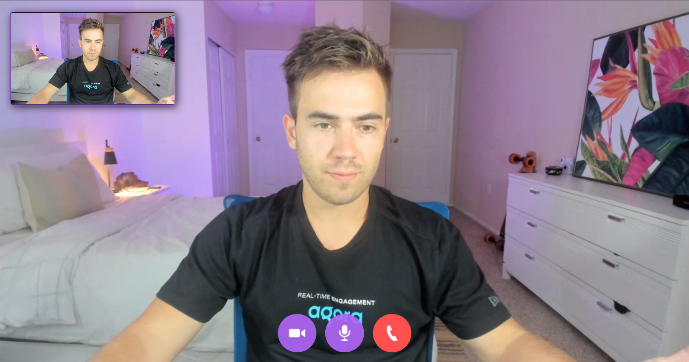

# PeerChat

A peer to peer WebRTC application with controls

# Installation

- - Create an account on agora.io and create an app to generate an APP ID
- - Update APP ID, Temp Token and Channel Name in main.js

```javascript
let APP_ID = "YOU-APP-ID";
```

<!--  -->
